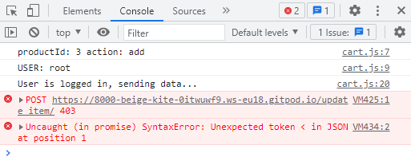
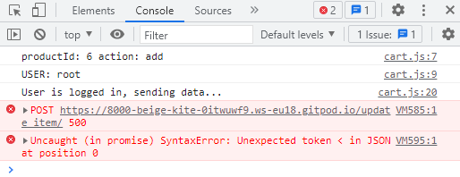

# The Build Lab
Phillip Healy's Milestone Project 4: Full Stack Frameworks with Django. 
The Build Lab is a website for people to come and learn about various deck building games. From Collectable Trading Card Games like Magic The Gathering, Yu-gi-oh, etc. To Living Card Games like Android: Netrunner. I'm obscessed with building decks and putting together strategy for a competitive edge, fun deck techs, or pure casual fun.

For this project I thought a site centered around my love of card games, showing off some free advice and entertaining opinions on the games that are out there, as well as some content locked behind a paywall for more serious enthusiasts would be perfect.

I went into this with so little time for many reasons, but worked myself to the bone to get it done and have something I can be proud of.

## Brief

### Project purpose: 

In this project, you'll build a full-stack site based around business logic used to control a centrally-owned dataset. You will set up an authentication mechanism and provide paid access to the site's data and/or other activities based on the dataset, such as the purchase of a product/service. 

### Value provided: 

1. By authenticating on the site and paying for some of its services, users can advance their own goals. Before authenticating, the site makes it clear how those goals would be furthered by the site. 

2. The site owner is able to make money by providing this set of services to the users. There is no way for a regular user to bypass the site's mechanisms and derive all of the value available to paid users without paying. 

### Project Requirements 

#### Main Technologies 

HTML, CSS, JavaScript, Python+Django 

Relational database (recommending MySQL or Postgres) 

Stripe payments 

Additional libraries and APIs 

#### Mandatory Requirements 

A project violating any of these requirements will FAIL: 

- Django Full Stack Project: Build a Django project backend by a relational database to create a website that allows users to store and manipulate data records about a particular domain. 

- Multiple Apps: The project must be a brand new Django project, composed of multiple apps (an app for each potentially reusable component in your project). 

- Data Modeling: Put some effort into designing a relational database schema well-suited for your domain. Make sure to put some thought into the relationships between entities. Create at least 2 custom django models beyond the examples shown on the course (changing the field names of the miniproject models is not customisation) 

- User Authentication: The project should include an authentication mechanism, allowing a user to register and log in, and there should be a good reason as to why the users would need to do so. e.g., a user would have to register to persist their shopping cart between sessions (otherwise it would be lost). 

- User Interaction: Include at least one form with validation that will allow users to create and edit models in the backend (in addition to the authentication mechanism). 

- Use of Stripe: At least one of your Django apps should contain some e-commerce functionality using Stripe. This may be a shopping cart checkout or single payments, or donations, etc. After paying successfully, the user would then gain access to additional functionality/content on the site. Note that for this project you should use Stripe's test functionality, rather than actual live payments. 

- Structure and Navigation: Incorporate a main navigation menu and structured layout (you might want to use Bootstrap to accomplish this). 

- Use of JavaScript: The frontend should contain some JavaScript logic you have written to enhance the user experience. 

- Documentation: Write a README.md file for your project that explains what the project does and the value that it provides to its users. 

- Version Control: Use Git & GitHub for version control. 

- Attribution: Maintain clear separation between code written by you and code from external sources (e.g. libraries or tutorials). Attribute any code from external sources to its source via comments above the code and (for larger dependencies) in the README. 

- Deployment: Deploy the final version of your code to a hosting platform such as Heroku. 

- Security: Make sure to not include any passwords or secret keys in the project repository. Make sure to turn off the Django DEBUG mode, which could expose secrets. 

## UX

### User Stories

- As a gamer I would like to see a collection of card games to play.
- As a boardgame enthusiast I would like to see entertaining opinions on various card games.
- As a casual Yu-gi-oh player I want to see if there's some tips on improving.
- As a professional Magic The Gathering player I want to see what others are doing with the new cards.
- As a competitive player I would like to see what game might be right for me to jump into.
- As a hobbyist I'd love to find out news about new cards and how they might change the current meta-game.
- As a fan I want to be able to register and support the site.

### Design

[Wireframes]()

[Schema]()

I chose to have the site be open and clean to maintain a great user experience. Keeping focus on the content the user has come for, while providing easy navigation
to and from every part of the site. I went with a healthy green colour which is traditionally associated with the environment and success.

For the font I chose Poppins; a free Google Font. Poppins is an internationalist take on geometric sans. Each letterform is nearly monolinear, 
with optical corrections applied to stroke joints where necessary to maintain an even typographic color. The Devanagari base character height and the Latin ascender height are equal; Latin capital letters are shorter than the Devanagari characters, and the Latin x-height is set rather high (https://fonts.google.com/specimen/Poppins#about).
I found this Font to be clean and clear at all font-weights, which is what I wanted in my consistent vision across the site.

## Features

### Existing Features
- A front page featuring latest news and spotlights on top 3 games.
- A page to see all games that have been reviewed on the site.
- A genres page to see the games in each genre.
- A review page to see each review.
- A log in/register page to become a user of the site.
- A profile page to show the reviews you've already left and allow you to edit/delete them.
- A form to add games, and reviews for those games.
- Have search bar for games, genres, reviews based on different terms.
- A logout button to see the site as a non-registered user or if you computer share etc.

### Future Features
- Affinity links on the games to earn money for site upkeep/future projects.
- Link to all games of a certain genre etc. when a user clicks on it.

## Technologies Used

### Python
- Python is an interpreted high-level general-purpose programming language. Python's design philosophy emphasizes code readability with its notable use of significant indentation. 
 Its language constructs as well as its object-oriented approach aim to help programmers write clear, logical code. (https://pythonbasics.org/)

### Django
- Django is a high-level Python web framework that encourages rapid development and clean, pragmatic design. Built by experienced developers, it takes care of much of the hassle of web development, so you can focus on writing your app without needing to reinvent the wheel. (https://www.djangoproject.com/)

### SQLite

### Pillow 
- The Python Imaging Library adds image processing capabilities to your Python interpreter. This library provides extensive file format support, an efficient internal representation, and fairly powerful image processing capabilities. The core image library is designed for fast access to data stored in a few basic pixel formats. It should provide a solid foundation for a general image processing tool.

### Jinja
- Jinja2 is one of the most used template engines for Python. It is inspired by Django's templating system but extends it with an expressive language that gives 
 template authors a more powerful set of tools. (https://www.palletsprojects.com/p/jinja/)

### Werkzeug 
- Werkzeug is a comprehensive WSGI web application library. It began as a simple collection of various utilities for WSGI applications and has become one of the
 most advanced WSGI utility libraries. Flask wraps Werkzeug, using it to handle the details 
 of WSGI while providing more structure and patterns for defining powerful applications. (https://www.palletsprojects.com/p/werkzeug/)

### Bootstrap
- Bootstrap is the most popular CSS Framework for developing responsive and mobile-first websites. (https://www.w3schools.com/whatis/whatis_bootstrap.asp)

### Balsamiq
- Balsamiq Wireframes is a rapid low-fidelity UI wireframing tool that reproduces the experience of sketching on a notepad or whiteboard, but using a computer. (https://balsamiq.com/wireframes/)

### Font Awsome
- Font Awesome is a font and icon toolkit based on CSS and Less. (https://fontawesome.com)

## Testing

### Bugs Encountered

- While creating JS logic for event handlers to add items to cart on store page. Continually got error 'synthax error, unexpected identifier' to the console.

- I had a colon in the wrong place, this took too long to find for such a small issue!

- While trying to update cart with JSON fetch I was running into CSRF (Cross Site Request Forgery protection) token error on both the console and terminal.

- Django docs had a JS script to sort this out by getting the cookie csrftoken and passing it through to the request handler.

- Request to pass data to backend is coming up with error saying "WSGIRequest object has no attribute 'data'"

- Changed to "data = json.loads(request.body)" and the request sent successfully.

## Deployment

1. Create repo "cardboard_craic" on Github based on Code-institute template.

2. Open workspace on Gitpod.

3. Install: updated pip, Flask, flask-pymongo, dnspython.

4. Create environments file env.py, and add this (and pycache) to gitignore for security.

5. create requirements.txt with pip3 freeze, create Procfile.

6. Log into MongoDB, join free cluster.

7. Create database cardboard_craic on free cluster.

8. Create collections on this database: games, genres, users, reviews as per schema.

9. Insert initial documents to these collections to test connectivity etc.

10. Back on Gitpod workspace create app.py and wire it up to the env.py.

11. Create first @app.route("/") and define a test page.

12. Go to Heroku.com and log in.

13. Create app cardboard_craic.

14. Go to Deploy and click deploy via Github. 

15. Put in Github username and repo name, make sure the correct repo opens.

16. Go to settings and click Reveal Config Vars. Add all info from env.py to this as it won't be picked up through Github (gitignore).

17. Back to deploy page click "Automatically deploy from branch: Master".

18. Wait to see this light up green. 

19. You can now "Open App" and will see the test page you created.

20. Live app:  

## Credits

### Content
- Back to top button modified from code taken from https://www.templatemonster.com/blog/back-to-top-button-css-jquery/
Window height calculations modified from http://martinpennock.com/blog/force-footer-bottom-page-css/

- checkout buttons and logic modified from https://codewithsteps.herokuapp.com/part/58e22993-f5a4-4ed7-92df-aede6711bf69/

- Script to generate CSRF token taken from https://docs.djangoproject.com/en/3.2/ref/csrf/

### Media
- Page logo designed and created by me on https://sketch.io/sketchpad/
- Schema created on https://draw.io/app.diagrams/

### Acknowledgements
Thank you to my wife and friends who tested the site during development.